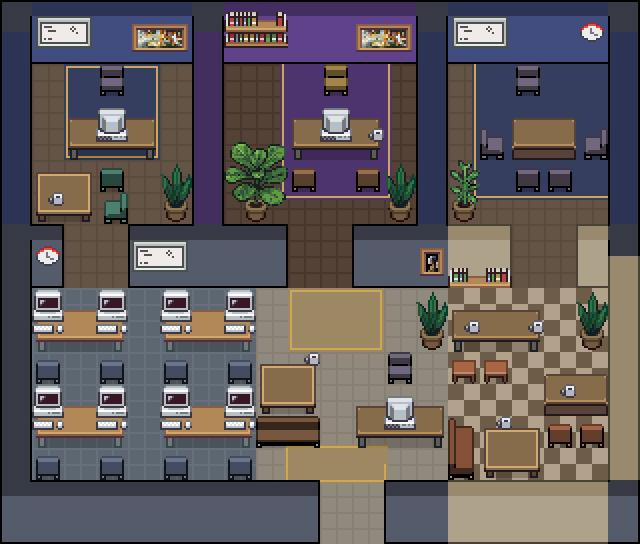

# Pixel Agents Office Kit

Конструктор офисов для расширения **[Pixel Agents](https://marketplace.visualstudio.com/items?itemName=pablodelucca.pixel-agents)**
(VS Code): пишешь планировку текстом — получаешь `layout.json`, картинку офиса 1:1 с движком и проверку на ошибки.
Никакого редактора мышкой, никакого VS Code для правок: всё оффлайн, только Python и Pillow.



20×16 тайлов: кабинеты CTO, CEO и переговорная сверху; снизу единый этаж — опенспейс на 8 мест, компактная входная зона с ресепшн и диваном, кафе. Есть версии больше и меньше.

## Быстрый старт

```bash
git clone https://github.com/Chinilshik-kalkulatorov/pixel-agents-office-kit
cd pixel-agents-office-kit
pip install pillow

python3 office_kit.py all layouts/office/spec.py out  # собрать + проверить + отрисовать
python3 apply_layout.py out.json                     # применить (бэкап делается сам)
```

Расширение следит за `~/.pixel-agents/layout.json` и подхватывает изменения живьём — VS Code перезапускать не нужно.

## Команды

| Команда | Что делает |
|---|---|
| `office_kit.py build spec.py out.json` | собрать layout.json из текстовой спеки |
| `office_kit.py validate layout.json` | проверить: границы, стены, пересечения, проходимость (BFS), места лицом к мониторам |
| `office_kit.py render layout.json out.png [--zoom N --chars --grid --labels]` | отрисовать 1:1 с движком |
| `office_kit.py all spec.py name` | всё сразу → `name.json`, `name.png`, `name_chars.png`, `name_grid.png` |
| `apply_layout.py layout.json` | записать в `~/.pixel-agents/layout.json` (валидирует, делает бэкап, пишет атомарно) |
| `sync_assets.py` | обновить спрайты из установленного расширения |

`--chars` рисует персонажа на каждом месте (проверить, кто куда смотрит), `--grid --labels` — сетка с номерами колонок и строк.

## Формат спеки

```python
MAP = """
################
#EEEEEEE#ccccc#
#EEEEEEE#ccccc#
#EEEEEEEEccccc#     <- дырка в стене = дверь
################
"""
LEGEND = {                       # символ карты -> пол (tile 1..9) + цвет (colorize HSBC)
  'E': {'tile': 4, 'color': {'h': 24, 's': 20, 'b': -50, 'c': -82}},
  'c': {'tile': 4, 'color': {'h': 26, 's': 18, 'b': -38, 'c': -84}},
}
WALL_COLOR  = {'h': 220, 's': 12, 'b': -85, 'c': -40}      # цвет стен по умолчанию
WALL_COLORS = {'E': {'h': 265, 's': 35, 'b': -75, 'c': -45}}  # стены комнаты 'E' — свои
FURNITURE = [
  ('DESK_FRONT', 3, 2),                                    # (тип, колонка, строка)
  ('PC_BACK', 4, 2),
  ('CUSHIONED_CHAIR_FRONT', 4, 1, {'h': 40, 's': 38, 'b': -20, 'c': 12, 'colorize': True}),  # + перекраска
]
CARPETS = [{'variant': 0, 'col': 3, 'row': 1, 'w': 5, 'h': 3,
            'color': {'h': 265, 's': 36, 'b': -38, 'c': -20},
            'accent': {'h': 42, 's': 55, 'b': 12, 'c': 0}}]
PETS = [0, 1]                                              # Claudio и Gitcat гуляют по офису
```

`#` — стена, `.` — пустота снаружи, любой другой символ — комната из `LEGEND`.
Полный каталог мебели, правила расстановки и палитры: **[docs/BRIEF.md](docs/BRIEF.md)**.
Все спрайты одной картинкой: [docs/contact_sheet.png](docs/contact_sheet.png), полы во всех цветах: [docs/floor_swatches.png](docs/floor_swatches.png).

## Грабли движка (сэкономят вам час)

- Горизонтальная стена рисуется на **2 тайла вверх** и прячет ряд пола над собой. Ряд проходим, но невидим — мебель туда не ставить.
- Настенные предметы вешаются только на горизонтальные стены: нижний ряд футпринта должен лежать на стене, под которой пол.
- Руководитель «лицом в комнату» = `PC_BACK` на столе + `CUSHIONED_CHAIR_FRONT` над столом. Работник «лицом в монитор» = `PC_FRONT_OFF` + `*_CHAIR_BACK` под столом.
- Агент выбирает место, если монитор стоит в пределах 3 тайлов прямо перед ним.
- `WOODEN_CHAIR_*` высотой 2 тайла (верхний — фоновый), значит ставится на строку выше сиденья.
- У предметов с `backgroundTiles` верхние ряды футпринта не блокируют ходьбу и могут заезжать на стены.
- Ковры (`CARPETS`) и питомцы (`PETS`) появились в расширении **1.4.1** — на 1.3.0 они просто игнорируются.

## Планировки

| Планировка | Размер | Что внутри |
|---|---|---|
| [layouts/office](layouts/office) | 20×16 = 320 тайлов | **боевая.** CTO, CEO и переговорная сверху; снизу опенспейс на 8 мест, входная зона с ресепшн и диваном, кафе. Без коридоров-пустышек |
| [layouts/compact](layouts/compact) | 15×12 = 180 тайлов | четыре комнаты, коридор с дорожкой, 17 мест |
| [layouts/tiny](layouts/tiny) | 15×10 = 150 тайлов | самая маленькая: те же четыре комнаты, максимально плотно |
| [layouts/mid](layouts/mid) | 24×18 = 432 тайла | промежуточная: то же самое, но с лобби во всю ширину |
| [layouts/big](layouts/big) | 35×25 = 875 тайлов | парадная: CTO, кабинет CEO, переговорная, лобби с входом с улицы, опенспейс, ресепшн, кафе |

Боевая в 2.7 раза меньше парадной по площади и помещается в панель VS Code без зума.
Как их сравнивали: [docs/compact_candidates.png](docs/compact_candidates.png), правила сжатия — [docs/BRIEF_COMPACT.md](docs/BRIEF_COMPACT.md).

Как это делалось: шесть агентов-дизайнеров, три жюри, три аудитора — брифы и списки правок лежат в
[docs/SYNTH.md](docs/SYNTH.md) и [docs/BRIEF_COMPACT.md](docs/BRIEF_COMPACT.md), если захотите повторить с другими агентами.

## Лицензия

Код кита — MIT (см. [LICENSE](LICENSE)). Спрайты в `assets/` и `furniture-catalog.json` взяты из
[pablodelucca/pixel-agents](https://github.com/pablodelucca/pixel-agents) (MIT), персонажи основаны на
[JIK-A-4, Metro City](https://jik-a-4.itch.io/metrocity-free-topdown-character-pack). Подробности — [NOTICE.md](NOTICE.md).
